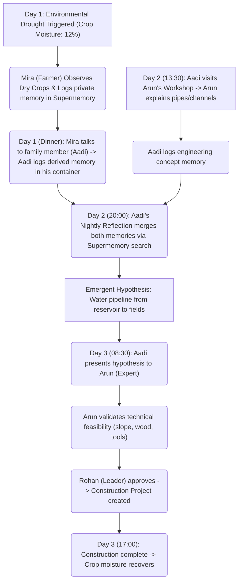

# MVP Scope and Scenario Guide - Autonomous AI Civilization

## 1. MVP Objective
The MVP is designed to prove the core thesis of **Persistent Multi-Agent Memory & Emergent Discovery** within a tight, reproducible, and accelerated 3-day simulation window. Rather than building a massive, unpredictable open-world simulator, the MVP focuses on a seeded vertical slice: the **Irrigation Discovery Chain**.

All memory operations use **Supermemory** as the exclusive vector memory provider. No other embedding or vector DB service is used.

---

## 2. Seeded Scenario: The Irrigation Discovery Chain
To guarantee that judges can witness the cognitive loop within 3 minutes, the world is pre-seeded with a specific set of attributes and triggers:



---

## 3. The 3-Minute Judge Demo Flow
1. **0:00 - 0:30 (Introduction & Map Walkthrough):**
   - The user loads the app and is greeted with a beautiful dark-mode glassmorphic interface.
   - The clock is ticking in accelerated mode.
   - User follows Mira (the Farmer) walking to the fields.

2. **0:30 - 1:00 (Drought & Direct Observation):**
   - A drought event is triggered. Crop soil moisture drops below 15%.
   - Mira's active sprite highlights. She observes the drought and is triggered to run her LLM Decision Chain.
   - She logs the memory to Supermemory: `"I am worried the dry field may reduce our harvest."`

3. **1:00 - 1:30 (Social Transmission):**
   - At dinner (18:30), Mira is co-located with Aadi (the Child).
   - A conversation starts. Mira says: `"The north field is drying up quickly, I fear a crop failure if we don't act."`
   - Aadi logs a **derived memory** in his own Supermemory container: `"Mira reported dry fields at the farm and fears crop failure."`

4. **1:30 - 2:00 (Knowledge Acquired & Nightly Reflection):**
   - On the next day, Aadi visits Arun the Engineer at his workshop. Arun shares: `"Pipes and channels can guide water across long distances, but it takes wood and tools to assemble."`
   - Aadi logs the engineering concept.
   - At 20:00, Aadi's reflection pipeline triggers. Aadi retrieves both memories from **Supermemory semantic search**, connects them, and creates an **Irrigation Hypothesis**.

5. **2:00 - 2:30 (Validation & Approval):**
   - Aadi presents the idea to Arun. Arun validates that there is enough wood (10 units) and tools (2 units) in the town inventory.
   - Rohan approves. A construction project is registered in the database.

6. **2:30 - 3:00 (The Climax: Provenance View):**
   - The project is complete. The fields turn green again.
   - The user opens the **Provenance Graph**. The screen displays a clear node-flow graph demonstrating how the initial dry soil observation ultimately led to the engineering solution, with each node linking to its Supermemory document.

---

## 4. MVP Implementation Checklist

### Phase 1: Foundation (Backend Core)
- [ ] Initialize FastAPI project with project structure
- [ ] Set up SQLite database with all schema tables
- [ ] Create seeding script for agents, locations, routines, resources
- [ ] Implement clock engine with 4 speed modes
- [ ] Implement routine engine (deterministic movement)
- [ ] Implement simulation engine (needs decay, weather, crop moisture)

### Phase 2: Supermemory Integration
- [ ] Install `supermemory` Python package
- [ ] Configure `SUPERMEMORY_API_KEY` environment variable
- [ ] Implement `supermemory_client.py` with add/search helpers
- [ ] Implement `service.py` with memory lifecycle orchestration
- [ ] Implement social memory transfer (derived memories)
- [ ] Implement public library container search

### Phase 3: AI Cognition Layer
- [ ] Define Pydantic schemas for structured LLM output
- [ ] Implement LangChain Decision Chain
- [ ] Implement LangChain Conversation Chain
- [ ] Implement LangChain Reflection Chain (Aadi)
- [ ] Implement LangChain Validation Chain
- [ ] Implement cognitive priority queue and throttling

### Phase 4: API & Realtime Layer
- [ ] Create world API endpoints
- [ ] Create agents API endpoints
- [ ] Create timeline API endpoints
- [ ] Create admin/simulation API endpoints
- [ ] Implement WebSocket/SSE streaming

### Phase 5: Frontend Dashboard
- [ ] Initialize React + Vite + TypeScript project
- [ ] Set up Tailwind CSS with custom HSL theme
- [ ] Implement TopBar with clock, speed controls, weather
- [ ] Implement Agent Roster (left sidebar)
- [ ] Implement 2D World Map with agent avatars
- [ ] Implement Inspector Panel (right sidebar)
- [ ] Implement Provenance Graph (React Flow)
- [ ] Connect to WebSocket/SSE for real-time updates
- [ ] Implement Zustand store for state management

### Phase 6: Integration & Demo Polish
- [ ] End-to-end integration testing
- [ ] Seed drought scenario verification
- [ ] 3-minute demo flow dry run
- [ ] Dark mode glassmorphic polish
- [ ] Memory activity indicators (Supermemory glow effect)

---

## 5. MVP Folder Structure (Monorepo)
```
ai-civilization/
├── backend/
│   ├── app/
│   │   ├── api/
│   │   │   ├── routers/
│   │   │   │   ├── world.py
│   │   │   │   ├── agents.py
│   │   │   │   ├── timeline.py
│   │   │   │   └── admin.py
│   │   │   └── main.py
│   │   ├── simulation/
│   │   │   ├── clock.py
│   │   │   ├── routine.py
│   │   │   └── engine.py
│   │   ├── memory/
│   │   │   ├── service.py
│   │   │   └── supermemory_client.py
│   │   ├── ai/
│   │   │   ├── orchestrator.py
│   │   │   └── prompts.py
│   │   ├── db/
│   │   │   ├── connection.py
│   │   │   ├── models.py
│   │   │   └── seeding.py
│   │   └── core/
│   │       └── config.py
│   └── requirements.txt
├── frontend/
│   ├── src/
│   │   ├── components/
│   │   │   ├── Map.tsx
│   │   │   ├── Inspector.tsx
│   │   │   ├── Roster.tsx
│   │   │   ├── TopBar.tsx
│   │   │   └── ProvenanceGraph.tsx
│   │   ├── store/
│   │   │   └── worldStore.ts
│   │   ├── App.tsx
│   │   └── main.tsx
│   ├── package.json
│   └── vite.config.ts
├── prd.md
├── design.md
├── architecture.md
├── mvp.md
└── plan.md
```

---

## 6. Key Technical Decisions for MVP

| Decision | Choice | Rationale |
|---|---|---|
| Vector Memory | **Supermemory** (mandatory) | Persistent, self-growing memory API with semantic search |
| Structured Data | SQLite | Local, zero-config, no auth needed |
| Backend Framework | FastAPI | Async, Python, built-in WebSocket support |
| Frontend Framework | React + Vite + TypeScript | Fast dev, type safety, broad ecosystem |
| Real-time | WebSocket/SSE | Low-latency state sync |
| State Management | Zustand | Lightweight, minimal boilerplate |
| Map Rendering | SVG | Simple, responsive, no heavy dependencies |
| Provenance Graph | React Flow | Mature node-graph library |
| LLM Framework | LangChain | Structured output, prompt templating |
